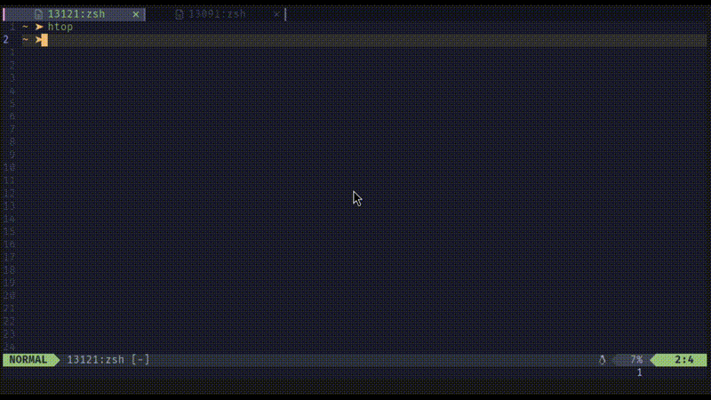

# stay_mode.nvim

Keep in terminal normal mode when you switch to another terminal buffer.




## Install

Using vim-plug:
```
Plug 'JefferyBoy/stay_mode.nvim'
```
Using lazy.nvim
```
use {'JefferyBoy/stay_mode.nvim'}
```
